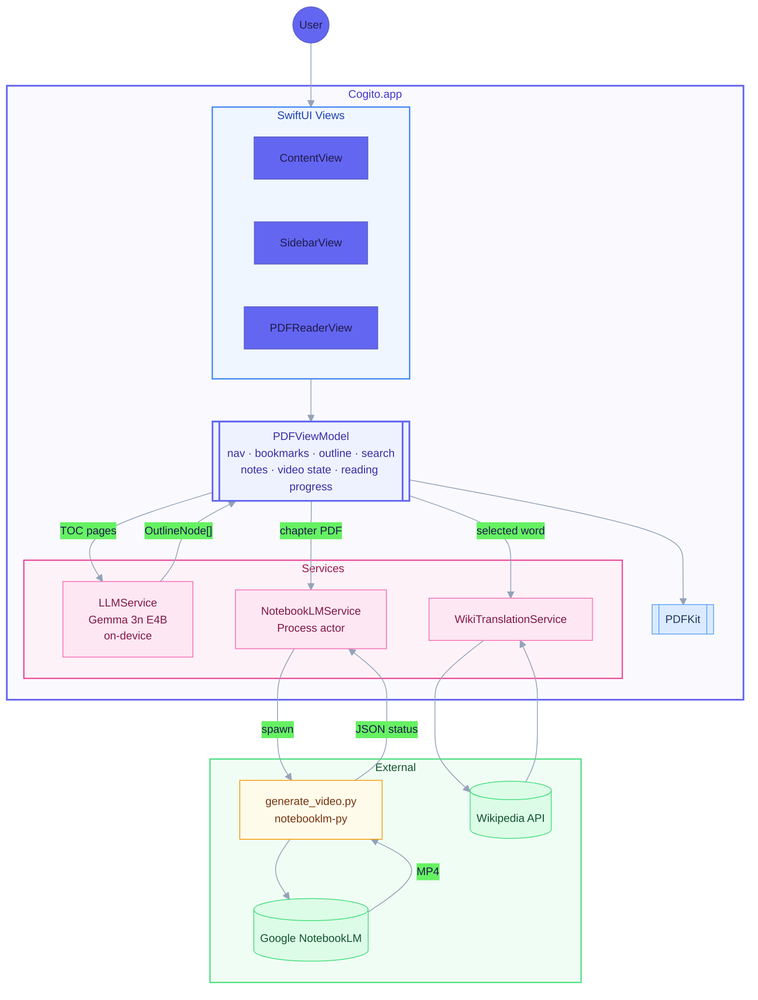

# Cogito

[](Sources/)
[](Package.swift)
[](LICENSE)

*Cogito, ergo sum.* I think, therefore I am.

macOS PDF reader for active reading. Open a PDF, take edge notes beside each page, look up any word, and generate a NotebookLM video overview for any chapter. Chapter structure is detected automatically on-device with a local LLM when the PDF has no embedded outline. Reading progress is restored when you reopen a book.

## Features

PDF reading with automatic margin cropping, single and two-page layouts, zoom, bookmarks, and full-text search. Reading progress is saved per book and restored on reopen.

Edge notes in two-page mode: narrow panels beside each page for free-form notes.

Word translation: select any word and get a Wikipedia-powered card in one of eight languages.

Chapter video overviews: click the video icon on any chapter's first page in two-page mode, or on the chapter row in the outline sidebar. Cogito extracts that chapter, uploads it to Google NotebookLM with an animation brief, and streams generation progress. The finished MP4 plays in a full-window overlay with captions. Chapters with existing videos show a green checkmark in the outline.

On-device LLM: Gemma 3n E4B via mlx-swift detects chapter structure from TOC pages when the PDF has no outline. Runs on the Apple Silicon Neural Engine, no internet required.

## Architecture



All views share one `PDFViewModel`. Services are injected as actors and communicate back via `AsyncStream` or `@Published` properties. The video path is the only one that crosses a process boundary: `NotebookLMService` spawns `generate_video.py` and reads JSON lines from stdout.

## Project structure

```
cogito/
├── Sources/Cogito/
│   ├── CogitoApp.swift                  # entry point, menu commands
│   ├── ContentView.swift                # root layout, toolbar, video overlay
│   ├── PDFViewModel.swift               # all app state
│   ├── PDFReaderView.swift              # PDFKit bridge, word selection
│   ├── SidebarView.swift                # outline / thumbnails / bookmarks / videos
│   ├── CornellNoteView.swift            # edge note editor
│   ├── TranslationCardView.swift        # word translation card
│   ├── VideoGenerationBannerView.swift  # generation status banner
│   ├── NotebookLMService.swift          # process actor, status streaming
│   ├── LLMService.swift                 # mlx-swift / Gemma wrapper
│   └── WikiTranslationService.swift     # Wikipedia API client
│
├── Scripts/
│   └── generate_video.py    # uploads chapter PDF, polls NotebookLM, saves MP4
│
├── Package.swift            # mlx-swift via SPM
└── Makefile                 # build / bundle / run
```

## Requirements

| | Version | |
|--|---------|--|
| macOS | 14+ | SwiftUI, PDFKit, AVFoundation |
| Swift | 6+ | |
| Python 3 | any | video bridge |
| [notebooklm-py](https://github.com/inconsistentpassion/notebooklm-py) | 0.3+ | NotebookLM client |
| [mlx-swift](https://github.com/ml-explore/mlx-swift) | 0.21+ | on-device inference |

## Building

```bash
pip install notebooklm-py
notebooklm login          # one-time, browser-based Google auth

make build && make run    # dev build
make bundle               # full .app with mlx.metallib and generate_video.py
```

## Video generation

Requires a Google account. Auth persists in a local cookie store via `notebooklm-py`.

`generate_video.py` receives a chapter PDF and the target output path from Swift, uploads the PDF plus an animation brief to a new NotebookLM notebook, and polls until the MP4 is ready. Status comes back as JSON lines on stdout; `NotebookLMService` parses them into `AsyncStream<VideoStatus>`.

Videos cache to `~/Library/Caches/com.cogito.app/Videos/` with a per-book hash in the filename.

## License

MIT
