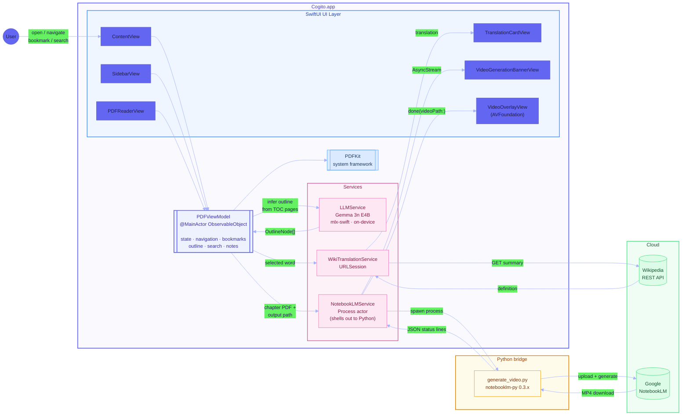

# Cogito

[](Sources/)
[](Package.swift)
[](LICENSE)

*Cogito, ergo sum.* I think, therefore I am.

A macOS PDF reader built to help you think. Most PDF readers display pages. Cogito turns reading into active thinking through margin notes, instant word translation, AI-generated chapter videos, and on-device LLM inference.

## What it does

**PDF reading** — opens any PDF with automatic margin cropping, single and two-page layouts, zoom, bookmarks, and full-text search. The outline sidebar supports both PDFKit-provided outlines and LLM-inferred chapter structure for PDFs with no embedded table of contents.

**Cornell notes** — narrow note panels flank the pages in two-page mode. Notes are saved per page, per document, and survive restarts.

**Word translation** — select any word to get a translation card powered by the Wikipedia summary API. Eight target languages, persistent preference.

**Video overviews** — hover any chapter in the outline and click the video icon. Cogito extracts that chapter as a PDF, uploads it to Google NotebookLM via a Python bridge, and generates an Explainer or Deep Dive video with Whiteboard or Slideshow style. A production brief instructs the generator to favor animation over static slides and to cover every concept in the chapter. The finished video plays in a full-window overlay with caption support.

**Local LLM inference** — Gemma 3n E4B runs on-device via mlx-swift for chapter outline detection and any future on-device tasks. No cloud call, no GPU required beyond the Apple Silicon Neural Engine.

## Architecture



**Data flows:**

| Action | Path |
|--------|------|
| Open PDF | `PDFViewModel` → `PDFKit` → renders in `PDFReaderView` |
| Infer outline (no TOC) | `PDFViewModel` → `LLMService` (Gemma, on-device) → `OutlineNode[]` |
| Select word | `PDFReaderView` → `PDFViewModel` → `WikiTranslationService` → Wikipedia API → `TranslationCardView` |
| Generate video | `PDFViewModel` → `NotebookLMService` → `generate_video.py` → NotebookLM → MP4 on disk → `VideoOverlayView` |

## Project structure

```
cogito/
├── Sources/Cogito/
│   ├── CogitoApp.swift              # App entry, menu commands
│   ├── ContentView.swift            # Root layout, toolbar, video overlay
│   ├── PDFViewModel.swift           # Central state (navigation, bookmarks,
│   │                                #   outline, notes, translation, video)
│   ├── PDFReaderView.swift          # PDFKit NSView bridge, selection handling
│   ├── SidebarView.swift            # Outline / thumbnails / bookmarks / videos
│   ├── CornellNoteView.swift        # Per-page margin note editor
│   ├── TranslationCardView.swift    # Floating word translation card
│   ├── VideoGenerationBannerView.swift  # Status banner (uploading/polling/done)
│   ├── NotebookLMService.swift      # Process actor: spawns Python, streams status
│   ├── LLMService.swift             # mlx-swift wrapper for Gemma 3n E4B
│   ├── WikiTranslationService.swift # Wikipedia summary API client
│   └── ...                          # Supporting views and utilities
│
├── Scripts/
│   └── generate_video.py            # Python bridge: PDFKit → NotebookLM → MP4
│
├── Package.swift                    # SPM: mlx-swift dependency
├── Makefile                         # build / bundle / run targets
└── FEATURES.md                      # Roadmap and design notes
```

## Requirements

| Dependency | Version | Role |
|------------|---------|------|
| macOS | ≥ 14 | SwiftUI, PDFKit, AVFoundation |
| Swift | ≥ 6 | Language and SPM |
| Python 3 | any recent | Video generation bridge |
| [notebooklm-py](https://github.com/inconsistentpassion/notebooklm-py) | ≥ 0.3 | NotebookLM API client |
| [mlx-swift](https://github.com/ml-explore/mlx-swift) | ≥ 0.21 | On-device LLM inference |

## Building

```bash
# Install Python dependency
pip install notebooklm-py

# Authenticate with NotebookLM (one-time, browser-based)
notebooklm login

# Build and run (dev build, no bundle)
make build && make run

# Full app bundle (copies mlx.metallib and generate_video.py into .app)
make bundle && open Cogito.app
```

The `mlx.metallib` GPU shader library is copied automatically from the Python MLX installation. If Python MLX is not installed (`pip install mlx`), on-device LLM inference will fall back to CPU.

## Video generation

Video generation uses Google NotebookLM, which requires a Google account. Authentication is browser-based and persists in a local cookie store managed by `notebooklm-py`.

The Python bridge (`Scripts/generate_video.py`) receives a chapter PDF and the full expected output path from the Swift side, uploads both the PDF and a production brief to a new NotebookLM notebook, triggers video generation, and polls until the MP4 is ready. Progress is emitted as JSON lines on stdout and parsed by `NotebookLMService` into a typed `AsyncStream<VideoStatus>`.

Videos are cached in `~/Library/Caches/com.cogito.app/Videos/` with a stable per-book hash suffix to prevent cross-book collisions.

## License

MIT
